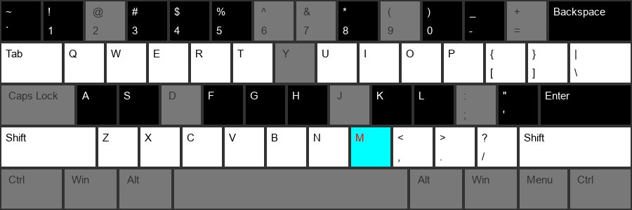

# Pianoputer

This library lets you to play your computer keyboard like a piano. Here is a [video](https://www.youtube.com/watch?v=z410eauCnHc) of it in action on a French azerty keyboard.

## Play!

Pianoputer only works in python3 so make sure you are using python3
```
pip install pianoputer
pianoputer
```

After a few seconds, the below image will appear in a window, indicating that the program is ready.
The cyan key is the key that the sample wav file is assigned to. By default this is c4, [the piano middle C at 261.6 hz](https://en.wikipedia.org/wiki/Piano_key_frequencies)
All white and black keys are transposed up and down from the anchor cyan key.



## Changing the sound file

You can provide your own sound file with

```
pianoputer --wav my_sound_file.wav
```
For example:
```
pianoputer -w audio_files/bowl_c6.wav
```
All white and black keys are transposed up and down from the anchor cyan key.

## Changing the keyboard layout

Note that the default keyboard configuration (stored in file `keyboards/qwerty_piano.txt`) is for the most commonly used QWERTY keyboards. You can change the configuration so that it matches your keyboard, for instance using the alternative `keyboards/azerty_typewriter.txt`:

```
pianoputer -k keyboards/azerty_typewriter.txt
```

These `.txt` files simply contain a sequence of key names and are easy to edit. For convenience this repository also provides a `make_kb_file.py` program:
```
python make_kb_file.py
```

This will let you press the keys in the order that you want, and create a new keyboard configuration file, by default `my_keyboard.kb` (just follow the instructions). You can then use the custom keyboard file with the --keyboard argument

## Local Installation
```
python3 -m venv venv
source venv/bin/activate
# if you want to edit the program and have pianoputer use your edits
pip install -e .
# to install pianoputer separately in your virtual environment
pip install .
pianoputer
```

## Attributions
- c4 piano sample from https://en.wikipedia.org/wiki/File:Middle_C.mid

## TODO
- limit setup.py instal to python <= 3.9 because somehow lvmlite is needed and https://github.com/numba/llvmlite/issues/530#issuecomment-555673204 -> https://github.com/numba/numba/issues/6345
- allow the word anchor as an anchor, if so then color active keys in ascending white
- update key identifiers to use different info?
  - use char info and fall back to keysym, a -> a, delete -> BackSpace
- maybe switch to tkinter for better keyboard handling
